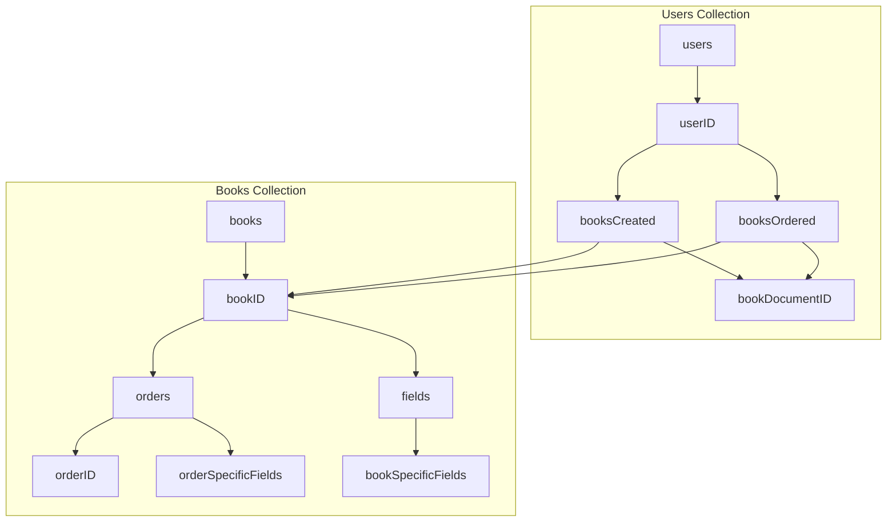

# Firestore Database Structure

## Explanation

### Users Collection

- **users/{userID}**: Document representing each user.
    - **booksCreated**: Sub-collection containing books created by the user.
        - **{bookID}**: Document with the `bookDocumentID` field.
    - **booksOrdered**: Sub-collection containing books ordered by the user.
        - **{bookID}**: Document with the `bookDocumentID` field.

### Books Collection

- **books/{bookID}**: Document representing each book.
    - **orders**: Sub-collection containing orders for the book.
        - **{orderID}**: Document with order-specific fields.
    - **fields**: Book-specific fields.
